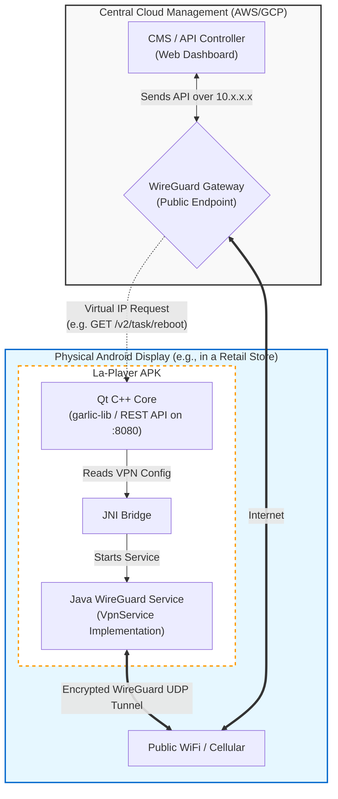
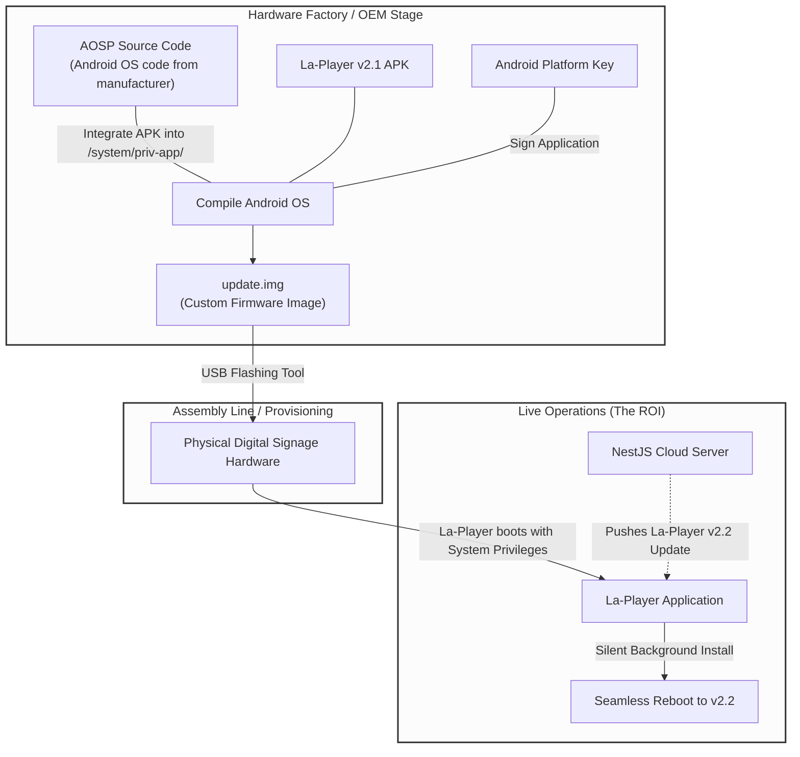

# La-Player: Embedded VPN Architecture Overview

This document outlines the proposed architecture for embedding a native WireGuard VPN directly into the **La-Player** Android application. This strategy is designed to securely manage a global fleet of 200,000+ digital signage screens without third-party licensing fees or relying on external VPN applications.

## 1. What We Will Achieve

By integrating WireGuard natively into the La-Player APK, we unlock the following capabilities:

- **Zero-Touch Deployment:** The device boots up, La-Player launches automatically (thanks to our `BootReceiver`), and the VPN connects instantly in the background. No user interaction is required.
- **Cost Elimination:** By running our own open-source WireGuard orchestration on the central server, we bypass expensive enterprise licensing fees (e.g., Tailscale, ZeroTier) for 200,000 devices.
- **Secure Remote Management:** The central Content Management System (CMS) can directly access the player's local REST API (port 8080) over the secure tunnel. We can trigger remote reboots, pull screenshots, or fetch real-time GPS coordinates directly, as if the device was on our desk.
- **App Consolidation:** Your field technicians only need to install one single `.apk` (La-Player) on the hardware, rather than juggling separate signage apps and VPN clients.

## 2. Architecture Illustration

The diagram below illustrates how the components interact. 



## 3. The Implementation Flow (How we build it)

If we proceed with this architecture, here is the technical roadmap for the code modifications:

1.  **Add Android Dependencies:** Modify the Android build script (`player/2.1_buildAndroid.sh` and Qt Gradle templates) to include `com.wireguard.android:tunnel`.
2.  **Create the Java `VpnService`:** Write a new Java class inside the `com.sagiadinos.garlic.player.java` namespace that utilizes the Android `VpnService` API to instantiate the WireGuard tunnel backend.
3.  **Establish the JNI Bridge:** Connect the Qt C++ Core (which downloads the initial CMS settings) to the new Java class so that the C++ logic can dynamically pass the WireGuard Private Key and Server IP to the Java layer.
4.  **Auto-Start Logic:** Tie the VPN launch sequence to the application's startup phase in `GarlicActivity.java` or `BootReceiver.java`, ensuring the tunnel comes online before the SMIL parser starts fetching heavy video assets.
5.  **Device Owner Provisioning:** (Operational Step) Ensure the Android hardware is provisioned using Android Enterprise (Device Owner mode) so that the OS grants La-Player silent permission to start the VPN without throwing a user-facing security prompt.

## 4. How the CMS (NestJS) Communicates via the VPN

The most critical architectural concept is that **NestJS does not handle any of the VPN packet logic.** 

The VPN (WireGuard) operates entirely at the Operating System layer (Linux on the central server, Android on the player). NestJS simply treats the 200,000 screens as if they are sitting on the physical local network switch in your server room.

### Step-by-Step Technical Flow:

**1. The VPN Tunnel (System Level - UDP)**
* Your central server runs Ubuntu/Linux. At the Linux kernel level, you install the WireGuard interface (e.g., `wg0`).
* The central server and the remote Android device connect to each other over the public internet using **Encrypted UDP** packets.
* The Linux OS assigns the Android player a virtual private IP on that `wg0` interface, like `10.8.0.50`.

**2. The NestJS Action (Application Level - HTTP/REST)**
* When an administrator clicks "Reboot Device" in the web dashboard, your NestJS application executes a standard HTTP request:
  ```typescript
  await axios.get('http://10.8.0.50:8080/v2/task/reboot?access_token=...');
  ```

**3. The Routing Handoff (The Magic)**
* NestJS asks the local Linux OS to route the HTTP/TCP packet to `10.8.0.50`.
* The Linux OS sees that `10.8.0.50` belongs to the `wg0` WireGuard subnet.
* Linux grabs the HTTP packet, encrypts it, wraps it inside a UDP packet, and automatically fires it over the internet to the retail store holding the specific Android 
device.
* The Android device receives the UDP packet, decrypts it, and hands the raw, standard HTTP request perfectly to La-Player's local Qt C++ REST API listening on port `8080`.

## 5. Custom Firmware & Auto-Update Architecture

For a massive fleet of 200,000 devices, pushing OTA (Over-The-Air) updates to the La-Player application must happen silently and seamlessly in the background. Because Android blocks unprompted background app installations for security, the ultimate solution is to bake La-Player into the device's actual firmware as a "System Application."

### 5.1 What You Achieve
- **True Auto-Update:** When La-Player downloads an update from your NestJS server, it installs perfectly in the background. No user prompts, no hanging waiting for someone to click "Install".
- **Native VPN:** La-Player can spin up the WireGuard VPN tunnel instantly on boot without ever asking the user for permission.
- **Kiosk Mode Lock:** The user cannot press the "Home" button to escape your application. La-Player *is* the operating environment.

### 5.2 The Firmware Flashing Flow



### 5.3 Technical Implementation Workflow
1. **Source the BSP:** Work with your hardware manufacturer to obtain the Android Board Support Package (BSP) or AOSP source code for your specific digital signage boards.
2. **Bake La-Player into the Source:** Your Android engineering team places the `la-player.apk` directly into the `packages/apps/` root folder of the Android OS code matrix. Crucially, La-Player is signed with the Android Platform Key, giving it core system-level permissions permanently.
3. **Flash the Boards:** At the factory (or at your staging facility), workers use a USB flashing tool (e.g., Rockchip FactoryTool, Amlogic Burn Tool) to burn the resulting `.img` file directly onto all 200,000 motherboards on the assembly line before shipment.

---

## 6. Language Architecture: C++ vs Java

The implementation is **~90% C++, ~10% Java**. The Java layer exists only because the Android OS mandates it for the `VpnService` permission gate — Android's `VpnService.Builder` API is not available via the NDK. Everything else lives in the Qt/C++ core.

| Layer | File | Language | Responsibility |
|---|---|---|---|
| VPN config model | `garlic-lib/vpn/wireguard_config.h/.cpp` | **C++** | Stores private key, server IP, allowed IPs, DNS |
| Tunnel engine | `garlic-lib/vpn/wireguard_tunnel.h/.cpp` | **C++** | WireGuard handshake, packet I/O, TUN fd management |
| C++ → Java bridge | `android_manager.cpp` (extend existing) | **C++** | Calls `GarlicVpnService` via `QAndroidJniObject` |
| Java → C++ bridge | `Java2Cpp.h` (extend existing) | **C++** | JNI callbacks from Java back into `LibFacade` |
| OS permission shim | `GarlicVpnService.java` *(new, ~50 lines)* | Java | Calls `VpnService.establish()`, returns TUN fd to C++ |
| Startup wiring | `GarlicActivity.java` (extend existing) | Java | One call to `startVpnService()` inside `onCreate()` |

The flow is:
```
Qt C++ (reads config from CMS)
  └─► android_manager.cpp  [QAndroidJniObject call]
        └─► GarlicVpnService.java  [VpnService.establish() → gets TUN fd]
              └─► Java2Cpp.h JNI callback  [passes fd back to C++]
                    └─► wireguard_tunnel.cpp  [owns all crypto & packet I/O]
```

---

## 7. Implementation Order

Build in this sequence so each step is independently testable before moving to the next.

### Step 1 — VPN Config Model (`garlic-lib/vpn/`)
**Files:** `wireguard_config.h`, `wireguard_config.cpp`

A simple data class that holds the WireGuard configuration pulled from the CMS:
- Device private key
- Server public key & endpoint (`host:port`)
- Assigned virtual IP (e.g. `10.8.0.50/32`)
- Allowed IPs & DNS

### Step 2 — Java VPN Shim (`GarlicVpnService.java`)
**Files:** `android/src/.../java/GarlicVpnService.java`, `AndroidManifest.xml`

Implements `android.net.VpnService`. Its only job:
1. Receive config values from C++ via JNI
2. Call `VpnService.Builder.establish()` to get the TUN file descriptor
3. Pass the fd back to C++ via a JNI callback

### Step 3 — JNI Bridge (extend existing files)
**Files:** `android_manager.cpp/.h`, `Java2Cpp.h`

Extend the existing `AndroidManager` class with two new methods:
- `startVpnTunnel(WireguardConfig &config)` — calls the Java shim
- A new `JNIEXPORT` function in `Java2Cpp.h` — receives the TUN fd from Java

### Step 4 — C++ Tunnel Engine (`garlic-lib/vpn/`)
**Files:** `wireguard_tunnel.h`, `wireguard_tunnel.cpp`

Owns the TUN fd and runs the WireGuard userspace implementation (using the WireGuard C library compiled as a static `.a` via qmake). Handles:
- Key generation & handshake
- Reading/writing encrypted packets on the TUN fd
- Reconnect logic on network change

### Step 5 — Startup Wiring
**Files:** `GarlicActivity.java` (`onCreate`), `BootReceiver.java`

Call `startService(new Intent(this, GarlicVpnService.class))` early in `onCreate()`, before the SMIL parser starts fetching assets. `BootReceiver` already starts `GarlicActivity`, so no separate boot logic is needed.

### Step 6 — Build Config
**Files:** `build.gradle` (Gradle template), `player-c2qml.pro`

- Add `com.wireguard.android:tunnel` to Gradle dependencies
- Add `ANDROID_PERMISSION_BIND_VPN_SERVICE` in `.pro` or manifest
- Link WireGuard static library in qmake

---

## 8. Testing Plan

### 8.1 Dev Device Testing (No Fleet Required)

**Build & install:**
```bash
cd build_scripts/player
./2.1_buildAndroid.sh
adb install -r la-player-android-*-debug.apk
```

**Watch logs in real time:**
```bash
adb logcat -s "GarlicVPN" "WireGuard" "GarlicActivity"
```

Expected output when working:
```
GarlicVPN: Tunnel interface created (fd=47)
GarlicVPN: Handshake complete with 10.8.0.1
GarlicVPN: Assigned virtual IP: 10.8.0.50
```

**Verify end-to-end from the server:**
```bash
curl http://10.8.0.50:8080/v2/status
```
A valid JSON response confirms the CMS can reach the player over the VPN.

### 8.2 The First-Time Permission Dialog

On a non-Device-Owner dev/test device, Android shows a **one-time system dialog** on first install:

> *"La-Player wants to set up a VPN connection — [OK] / [Cancel]"*

- Tap **OK** once during development. It never appears again for that install.
- On fully provisioned Device Owner hardware this dialog is **suppressed entirely** by the OS.

### 8.3 Debug Status Overlay (QML — stripped in release)

A small QML panel compilable into debug builds to show live VPN state on-screen without needing ADB:

```qml
// root_qtm.qml — visible only when launched with --vpn-debug flag
Rectangle {
    visible: Qt.application.arguments.indexOf("--vpn-debug") >= 0
    anchors { top: parent.top; right: parent.right }
    width: 220; height: 80; radius: 6
    color: vpnConnected ? "#CC00AA44" : "#CCAA0000"

    Column {
        padding: 8; spacing: 4
        Text { text: "VPN: " + vpnStatus;        color: "white"; font.pixelSize: 12 }
        Text { text: "IP:  " + vpnVirtualIp;     color: "white"; font.pixelSize: 12 }
        Text { text: "Last: " + lastHandshake + "s ago"; color: "white"; font.pixelSize: 12 }
    }
}
```

Launch with the overlay visible:
```bash
adb shell am start \
  -n com.sagiadinos.garlic.player/.java.GarlicActivity \
  --es vpn_debug true
```

### 8.4 Three-Phase Test Checklist

| Phase | Goal | Pass Condition |
|---|---|---|
| **1 — Local only** | TUN interface created, permission granted | `adb logcat` shows fd assignment |
| **2 — With WireGuard server** | Full handshake, virtual IP assigned | `curl http://<vpn-ip>:8080/v2/status` responds |
| **3 — Full CMS integration** | CMS can send commands over VPN | Dashboard reboot/screenshot triggers confirmed on device |
